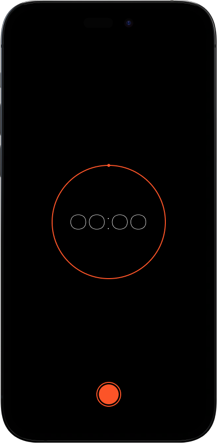
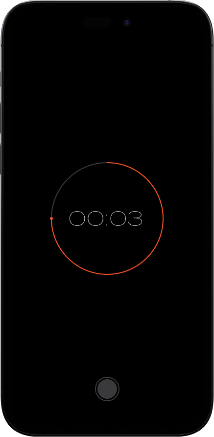
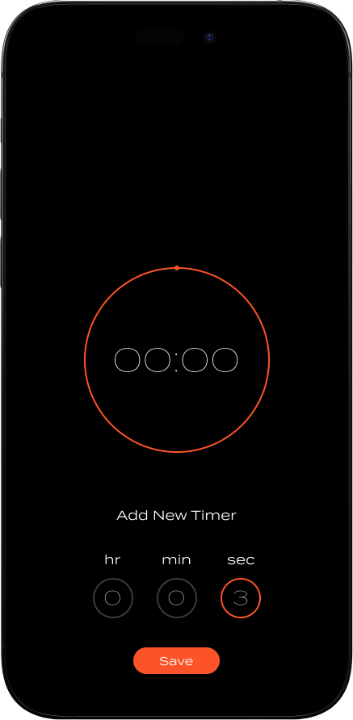

# Timer Mobile Application

## About Application
Timer is a mobile application which follows the MVVM architecture. This application built in Xcode using Swift programming language and SwiftUI framework. In this application you can set the time you want and the application automatically counts down until it covers the time entered by the user.

## Screenshots

      

## Run The Application

<a href="https://www.instagram.com/p/CpUcl2mAcaj/" target="_blank">Here</a>

## Find Me Also On
<a href="https://www.instagram.com/nickmadethisone/" target="_blank">Instagram</a>  
<a href="https://www.linkedin.com/in/nick-theodoridis-75097a266/" target="_blank">LinkedIn</a>  
<a href="https://twitter.com/nickiOSDev" target="_blank">Twitter</a>

